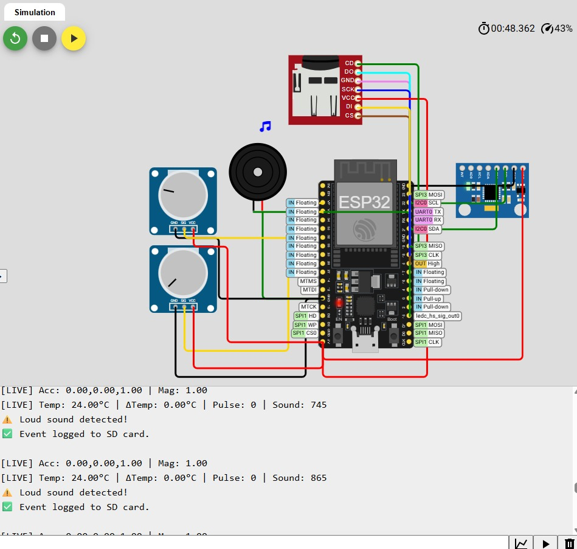

# Smart Monitoring for Trauma Outpatients

The prototype is a smart ESP32-based system designed to monitor trauma outpatients at home. It detects falls, temperature anomalies, pulse spikes, and loud sounds, and alerts via buzzer while logging critical events to an SD card.

## Wokwi Simulation

[▶️ Click here to run the Wokwi simulation](https://wokwi.com/projects/433441869261032449)

## Project Synopsis

Refer to [📄 TraumaOutpatientMonitoring_Synopsis.pdf](TraumaOutpatientMonitoring_Synopsis.pdf) for a brief overview of the project goals, components, features, and usage

## Components Used
- ESP32 Dev Module
- MPU6050 (Accelerometer + Temperature)
- SD Card Module
- Buzzer
- Potentiometers (simulating pulse and sound sensors)

## Use Case
Outpatients recovering from trauma, accidents, or surgery may be at risk while alone. This system helps monitor their condition in real-time with minimal hardware.

## Screenshots

### 1. Circuit Connections  

### 2. Online Logging  

### 3. Sound Detection  

### 4. Pulse Abnormality + Temperature Spike  

### 5. Fall Detection  

